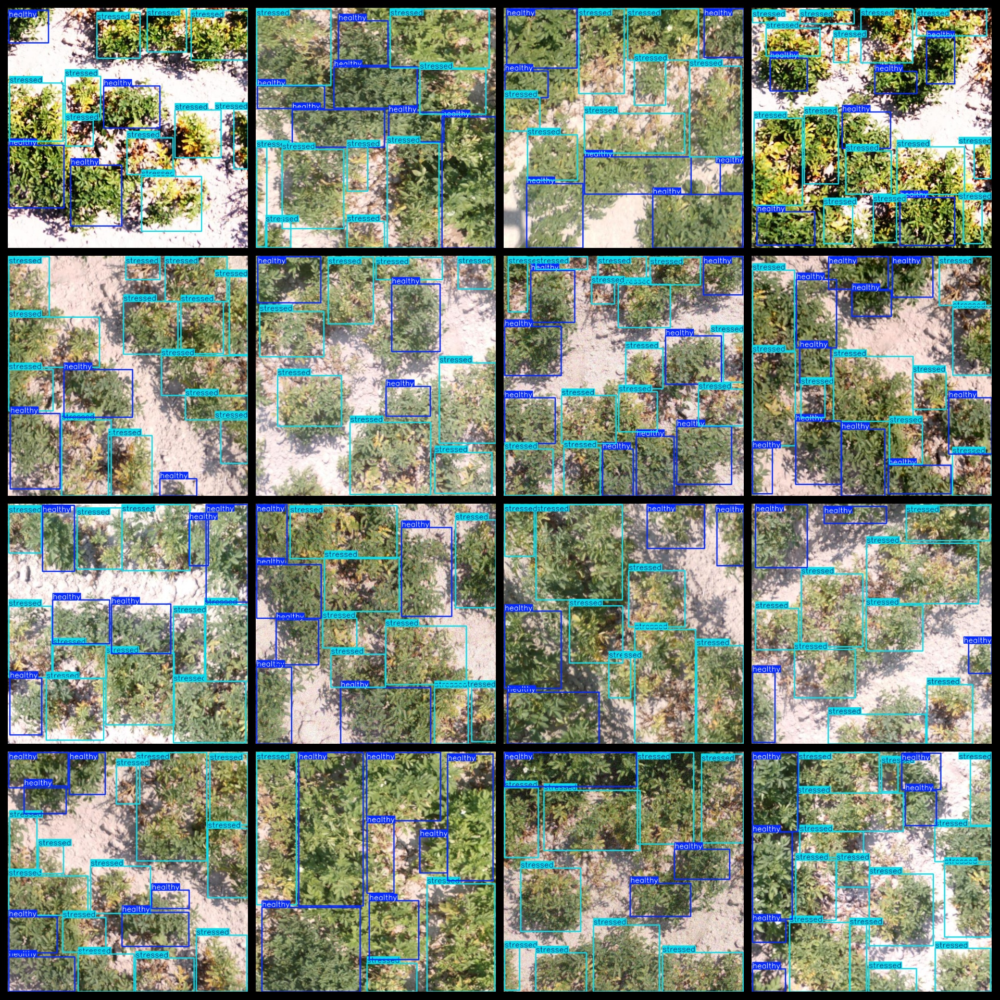

# Aerial Plant Leaf Health Status Detection Dataset 1534 imagesVOC+YOLO

Aerial Plant Leaf Health Status Detection Dataset 1534stretchVOC+YOLO

Dataset format: Pascal VOC format + YOLO format (the txt file does not contain the split path, it only contains jpg images and corresponding VOC format xml files and yolo format txt files)

Number of images (number of jpg files): 1534

Tagged quantity (xml file count): 1534

Marked quantity (txt file count): 1534

Label count: 2

The Github repository is: datasets_sl

Annotation class names: ["healthy","stressed"]

Number of boxes labeled in each category:

Healthy Frames = 8425

Stressed frames = 12401 (ill or in poor condition)

Total frames: 20826

Number of images per category:

Healthy possessing the number of images = 1529

Stressed occupancy = 1509

Image resolution: 640x640

Use the labeling tool: labelImg

Dataset Augmentation: No

Rules for annotation: Draw a rectangle around the category.

Important note: The dataset does not have been divided into training, validation, and testing sets.

Special Disclaimer: This dataset does not guarantee the accuracy of the trained models or weight files.

Annotation and image details are as follows:

## Images

---

Here is a pay link on Stripe (https://buy.stripe.com/3cs8yP7sY87d0vu9AB). Please contact me lonlonago@foxmail.com after funding $89, and I will send you a complete data files, thank you!

